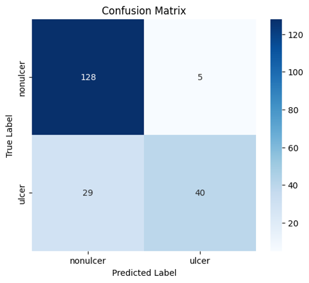
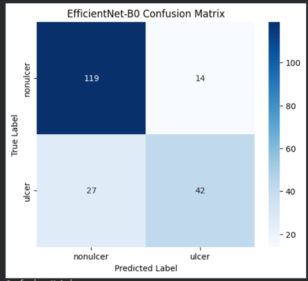
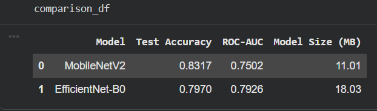
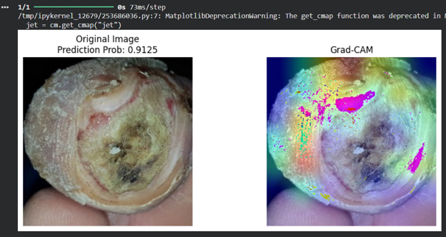
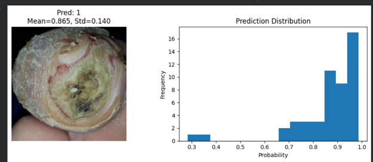
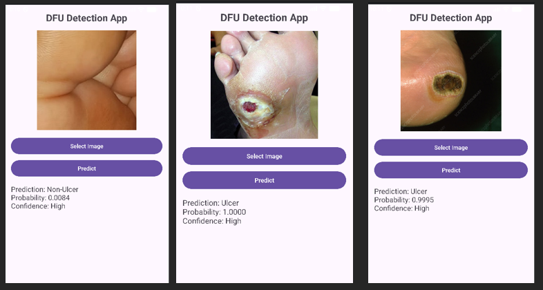
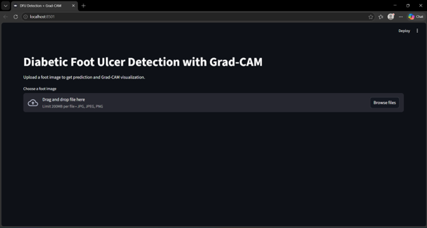
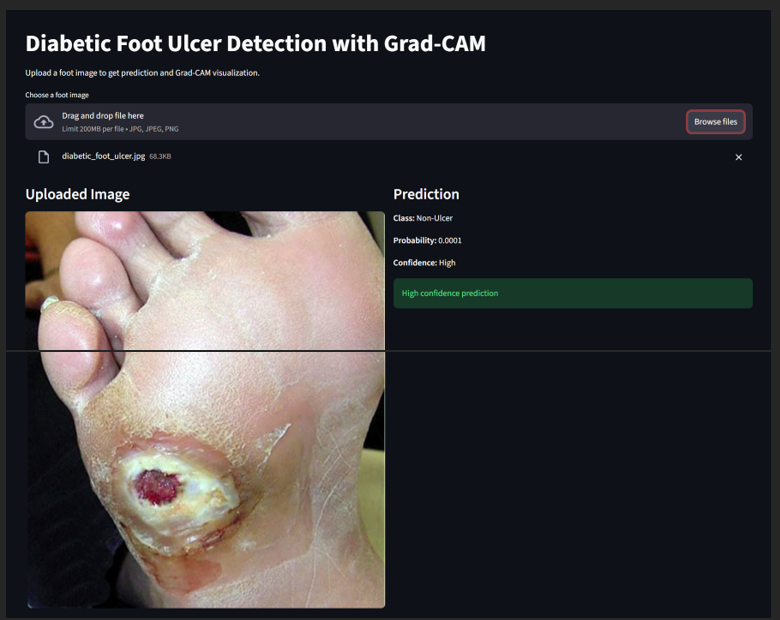

# Diabetic Foot Ulcer Detection

### Explainable and Mobile-Deployable Deep Learning for Diabetic Foot Ulcer Detection Using Smartphone Images

An open-ended **EEE 4710: Machine Learning and Artificial Intelligence** course project focused on detecting diabetic foot ulcers from foot images using transfer learning, explainable AI, uncertainty estimation, and lightweight deployment.

The project compares **MobileNetV2** and **EfficientNet-B0**, incorporates **Grad-CAM** for model interpretability, explores **Monte Carlo Dropout** for uncertainty estimation, and deploys the selected MobileNetV2 model using TensorFlow Lite and a Streamlit-based web application.

> **Disclaimer:** This project was developed for academic and research purposes. It is not a clinically validated diagnostic system and should not be used as a substitute for professional medical assessment.

---

## Course Information

**Course:** EEE 4710 — Machine Learning and Artificial Intelligence  
**Project Type:** Open-Ended Academic Project  
**Institution:** Islamic University of Technology (IUT)

**Original Project Title:**  
*An Explainable and Mobile-Deployable Deep Learning Framework for Diabetic Foot Ulcer Detection Using Smartphone Images*

---

## Project Overview

Diabetic Foot Ulcer (DFU) is a serious complication of diabetes that can lead to infection and, in severe cases, lower-limb amputation.

For this open-ended machine learning project, our team selected **diabetic foot ulcer detection** as the application problem and developed a binary image-classification system capable of distinguishing between:

- **Ulcer**
- **Non-Ulcer**

The project was designed around four main goals:

1. Develop a deep-learning model for DFU image classification.
2. Make model predictions more interpretable using **Grad-CAM**.
3. Explore prediction uncertainty using **Monte Carlo Dropout**.
4. Optimize the selected model for lightweight deployment using **TensorFlow Lite**.

---

## System Workflow

```text
Foot Image
    │
    ▼
Image Preprocessing
(224 × 224)
    │
    ▼
Transfer Learning
    │
    ├── MobileNetV2
    │
    └── EfficientNet-B0
    │
    ▼
Model Evaluation
    │
    ├── Accuracy
    ├── Precision
    ├── Recall
    ├── F1-Score
    └── ROC-AUC
    │
    ▼
Best Deployment Model
MobileNetV2
    │
    ├── Grad-CAM Explainability
    ├── Uncertainty Experiments
    ├── TensorFlow Lite
    ├── Android Prototype
    └── Streamlit Web App
```

---

## Dataset

The project dataset was derived from the publicly available **Diabetic Foot Ulcer (DFU) Dataset** on Kaggle:

[Diabetic Foot Ulcer (DFU) Dataset](https://www.kaggle.com/datasets/laithjj/diabetic-foot-ulcer-dfu)

The original Kaggle dataset was **not used directly**. The images were manually reviewed, filtered, and reorganized according to the requirements of this project.

### Dataset Preparation

The preparation process included:

- Manual review of available images
- Removal of unclear or unsuitable samples
- Removal of confusing samples such as callus or mixed-condition images where necessary
- Organization into two classes:
  - `ulcer`
  - `nonulcer`
- Creation of separate training, validation, and test subsets
- Image resizing to **224 × 224** during model preprocessing

The curated dataset followed this structure:

```text
dataset4/
├── train/
│   ├── nonulcer/
│   └── ulcer/
├── val/
│   ├── nonulcer/
│   └── ulcer/
└── test/
    ├── nonulcer/
    └── ulcer/
```

### Dataset Distribution

| Split | Non-Ulcer | Ulcer | Total |
|---|---:|---:|---:|
| Training | 593 | 355 | 948 |
| Validation | 194 | 90 | 284 |
| Test | 135 | 71 | 206 |
| **Total** | **922** | **516** | **1,438** |

The image dataset itself is not redistributed in this repository.

The [`Data/dataset_manifest.csv`](Data/dataset_manifest.csv) file records the files, class assignments, dataset splits, file formats, file sizes, and SHA-256 hashes of the curated dataset used during the project.

Additional dataset documentation is available in [`Data/README.md`](Data/README.md).

---

## Model Development

Two lightweight convolutional neural-network architectures were evaluated using **transfer learning**:

### MobileNetV2

MobileNetV2 was initialized with ImageNet pretrained weights without its original classification head.

A custom binary-classification head was added using:

```text
MobileNetV2 Base
      │
      ▼
Dense Layer
128 Units + ReLU
      │
      ▼
Dropout (0.5)
      │
      ▼
Dense (1)
Sigmoid
```

### EfficientNet-B0

EfficientNet-B0 was also initialized with pretrained ImageNet weights and adapted for binary classification.

### Training Configuration

The models were trained using:

- **Optimizer:** Adam
- **Loss Function:** Binary Cross-Entropy
- **Output Activation:** Sigmoid
- **Input Resolution:** 224 × 224
- **Training Epochs:** 10
- **Task:** Binary classification

The complete experimental workflow is available in:

[`Notebook/DiabeticUlcer_final_project4710.ipynb`](Notebook/DiabeticUlcer_final_project4710.ipynb)

---

## Model Performance

### MobileNetV2

The original course-project evaluation produced:

- **Test Accuracy:** 83.17%
- **ROC-AUC:** 0.7502
- **Model Size:** 11.01 MB

#### Confusion Matrix



---

### EfficientNet-B0

The original course-project evaluation produced:

- **Test Accuracy:** 79.70%
- **ROC-AUC:** 0.7926
- **Model Size:** 18.03 MB

#### Confusion Matrix



---

## Model Comparison

| Model | Test Accuracy | ROC-AUC | Model Size |
|---|---:|---:|---:|
| **MobileNetV2** | **83.17%** | 0.7502 | **11.01 MB** |
| EfficientNet-B0 | 79.70% | **0.7926** | 18.03 MB |



Although EfficientNet-B0 obtained a higher ROC-AUC score, **MobileNetV2 was selected for deployment** because it achieved higher test accuracy while maintaining a smaller model size and better suitability for resource-constrained devices.

---

## Explainable AI with Grad-CAM

Deep-learning image classifiers can be difficult to interpret because the internal reasoning behind a prediction is not directly visible.

To improve interpretability, the project integrates **Gradient-weighted Class Activation Mapping (Grad-CAM)**.

Grad-CAM generates a heatmap indicating the image regions that had greater influence on the model's prediction.



This provides a visual method for inspecting whether the model is focusing on relevant areas of the foot image rather than unrelated background features.

Grad-CAM is implemented in both the experimental notebook and the Streamlit web application.

---

## Uncertainty Estimation

An experimental **Monte Carlo Dropout** approach was investigated to estimate prediction uncertainty.

Instead of performing only one forward pass, the model performs multiple predictions while dropout remains active.

The prediction distribution is then summarized using:

- Mean prediction
- Standard deviation

Conceptually:

```text
High mean + Low variation
        ↓
Confident ulcer prediction

Low mean + Low variation
        ↓
Confident non-ulcer prediction

Prediction near 0.5
or high variation
        ↓
Uncertain prediction
```

Example:



### Important Distinction

The **Monte Carlo Dropout implementation is an experimental uncertainty-estimation component in the notebook**.

The current Streamlit web application uses a simpler confidence indicator based on the distance of the model's sigmoid probability from the `0.5` classification threshold.

Therefore, the web application's High/Medium/Low confidence label should not be interpreted as Monte Carlo Dropout uncertainty.

---

## TensorFlow Lite Deployment

To make the selected model more suitable for deployment on mobile and resource-constrained devices, the trained MobileNetV2 model was converted from Keras `.h5` format to **TensorFlow Lite (`.tflite`)**.

The original deployment experiment produced:

| Format | Model Size | Inference Time |
|---|---:|---:|
| Keras `.h5` | 11.01 MB | 110.24 ms |
| TensorFlow Lite `.tflite` | **9.07 MB** | **13.77 ms** |

The same test image produced the same recorded prediction value in both formats during the comparison experiment.

The TensorFlow Lite model used for the mobile prototype is available at:

[`Models/mobilenetv2_binary_v2.tflite`](Models/mobilenetv2_binary_v2.tflite)

---

## Android Mobile Prototype

An Android prototype was developed during the original course project using **Android Studio** and the TensorFlow Lite version of MobileNetV2.

The application allowed the user to:

1. Select a foot image.
2. Run the TFLite model locally.
3. Receive an Ulcer or Non-Ulcer prediction.
4. View the model probability and confidence indication.



The original Android Studio source project is no longer available, so it is not included in this repository.

The TFLite model and screenshots are retained as documentation of the mobile-deployment component completed during the project.

---

## Streamlit Web Application

A lightweight web application was also developed using **Streamlit**.

The web application allows users to:

- Upload a foot image
- Obtain an Ulcer / Non-Ulcer prediction
- View the prediction probability
- View a simple confidence category
- Generate a Grad-CAM visualization
- Inspect the raw Grad-CAM heatmap

### Interface



### Prediction and Grad-CAM



The web application source is available at:

[`Web-app/app.py`](Web-app/app.py)

---

## Running the Web Application

### 1. Clone the Repository

```bash
git clone https://github.com/Ar-Rafi-Ishraq/Diabetic-Foot-Ulcer-Detection-EEE4710.git
cd Diabetic-Foot-Ulcer-Detection-EEE4710
```

### 2. Create a Virtual Environment

#### Windows

```bash
python -m venv .venv
.venv\Scripts\activate
```

#### Linux / macOS

```bash
python3 -m venv .venv
source .venv/bin/activate
```

### 3. Install Required Packages

```bash
pip install -r Web-app/requirements.txt
```

### 4. Run the Application

```bash
streamlit run Web-app/app.py
```

The application loads the trained MobileNetV2 model from:

```text
Models/mobilenetv2_binary_v3.h5
```

---


## Video Demonstration

A complete demonstration of the project, including model predictions, explainability, uncertainty estimation, and application deployment, is available below.

### [▶ Watch the Full Project Demonstration](https://drive.google.com/file/d/1XCAaVvSPHThfm6WJjqvAWDCxO4rKKK-P/view?usp=sharing)

The demonstration covers the major components of the EEE 4710 project, including:

- Diabetic foot ulcer image classification
- MobileNetV2 and EfficientNet-B0 model evaluation
- Grad-CAM visualization
- Prediction uncertainty experiments
- TensorFlow Lite deployment
- Android mobile application
- Streamlit web application

---


## Repository Structure

```text
Diabetic-Foot-Ulcer-Detection-EEE4710/
│
├── Assets/
│   ├── gradcam/
│   │   └── gradcam-example.png
│   │
│   ├── mobile-app/
│   │   └── mobile-app-demo.png
│   │
│   ├── model-results/
│   │   ├── efficientnet-confusion-matrix.png
│   │   ├── mobilenet-confusion-matrix.png
│   │   └── model-comparison.png
│   │
│   ├── uncertainty/
│   │   └── mc-dropout-example.png
│   │
│   └── web-app/
│       ├── web-app-demo1.png
│       └── web-app-demo2.png
│
├── Data/
│   ├── README.md
│   └── dataset_manifest.csv
│
├── Docs/
│   ├── ML Project 4710 report 210021330, 210021206, 210021234.pdf
│   └── Proposed-Research-Title.pdf
│
├── Models/
│   ├── mobilenetv2_binary_v2.tflite
│   └── mobilenetv2_binary_v3.h5
│
├── Notebook/
│   └── DiabeticUlcer_final_project4710.ipynb
│
├── Web-app/
│   ├── app.py
│   └── requirements.txt
│
└── README.md
```

---

## Technologies Used

- Python
- TensorFlow
- Keras
- MobileNetV2
- EfficientNet-B0
- Transfer Learning
- TensorFlow Lite
- Grad-CAM
- Monte Carlo Dropout
- Streamlit
- NumPy
- Matplotlib
- scikit-learn
- Pillow
- Google Colab
- Android Studio

---

## Key Features

- Binary diabetic foot ulcer image classification
- Transfer learning using pretrained CNN architectures
- MobileNetV2 vs EfficientNet-B0 comparison
- Grad-CAM explainability
- Experimental Monte Carlo Dropout uncertainty estimation
- TensorFlow Lite model conversion
- Lightweight mobile-deployment prototype
- Streamlit prediction interface
- Dataset manifest documenting the curated dataset

---

## Limitations

The project has several limitations:

- The dataset is relatively small and heterogeneous.
- Only binary classification was considered.
- Visually similar conditions such as callus, healed ulcers, and early-stage lesions can be difficult to distinguish.
- The system was not clinically validated.
- Performance was evaluated only within the scope of the academic project dataset.
- The Android source project is no longer available.
- The web application's displayed confidence category is not a calibrated clinical confidence score.

### Reproducibility Note

This repository preserves the **original EEE 4710 project dataset organization and reported experimental results**.

A later file-level audit of the archived curated dataset identified exact duplicate images occurring across some training, validation, and test subsets. This may introduce data leakage and influence evaluation results.

Therefore, the reported metrics should be interpreted as results from the original course project rather than benchmark or clinical-performance claims.

A future post-course revision can address this by creating duplicate-aware dataset splits, retraining the models, and reporting the revised results separately from the original submission.

---

## Future Improvements

Potential improvements include:

- Constructing leakage-free training, validation, and test splits
- Expanding the dataset with more diverse and clinically representative images
- Moving from binary to multi-class classification
- Separating ulcer, callus, normal, healed-ulcer, and other related conditions
- Improving model calibration and uncertainty estimation
- Evaluating additional lightweight CNN architectures
- Applying model quantization for further mobile optimization
- Improving Grad-CAM localization
- Rebuilding and improving the Android application
- Performing external validation using independent datasets
- Evaluating the system with clinical experts

---


## Team

**Group Name:** Algorithm Architects

| Team Member | Student ID |
|---|---|
| Ar-Rafi Ishraq | 210021330 |
| Mohd. Abdullah Abrar | 210021206 |
| Md. Sabbir Hossain Tashrif | 210021234 |

---

## Project Documentation

The original academic materials are available in the `Docs/` directory:

- [Project Proposal](Docs/Proposed-Research-Title.pdf)
- [Final Project Report](Docs/ML%20Project%204710%20report%20210021330,%20210021206,%20210021234.pdf)

These documents preserve the project as originally proposed, implemented, evaluated, and submitted for EEE 4710.

---

## Acknowledgment

The project uses data derived from the publicly available **Diabetic Foot Ulcer (DFU) Dataset** hosted on Kaggle.

The original dataset creators and contributors are acknowledged for making the image data available for research and educational use.
